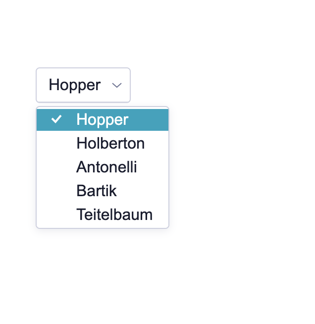

# React Select Menu

Simple Select Menu for React applications

## Usage

This is a basic usage of my react select menu written in Typescript. Please note; this component hasn't been published to **NPM** registry yet and as such you have to place the component inside the App.tsx file so it has the theme style and you could switch theme to see the difference.

### Features

- Minimal setup
- Simple to use
- Extended Menu item to provide additional text
- Light and Dark colour scheme

### Basic usage

#### Simple select

Displaying a simple select option, pass into the option props an array of objects with **_key_** and **_value_** properties.



```js
	import { Select } from  "./components";

	const items = [
		{key:  "hopper", value:  "Hopper"},
		{key:  "holberton", value:  "Holberton"},
	]

	<Select
		onChange={onInputChange}
		options={items}
	/>
```

#### Grouped select

Displaying a grouped select option, pass into the option props an array of grouped array objects with **_key_** and **_value_** properties.

```js
	import { Select } from  "./components";

	const items = [
		[{key:  "hopper", value:  "Hopper"}, {key:  "holberton", value:  "Holberton"}],
		[{key:  "antonelli", value:  "Antonelli"}, {key:  "bartik", value:  "Bartik"}],
	]

	<Select
		onChange={onInputChange}
		options={items}
	/>
```

#### Select with extended menu item

Displaying an extended select option, pass into the option props simple or grouped array items with **_key_**, **_value_** and **_desc_** properties. Make sure the isExtendible prop with a value of true is added on the select component to let select know that you want to use the extended menu item.

```js
	import { Select } from  "./components";

	const items = [
		[{key:  "hopper", value:  "Hopper", desc: "lorem ipsum"}, {key:  "holberton", value:  "Holberton", desc: "lorem ipsum"}],
		[{key:  "antonelli", value:  "Antonelli", desc: "lorem ipsum"}, {key:  "bartik", value:  "Bartik", desc: "lorem ipsum"}],
	]

	<Select
		onChange={onInputChange}
		options={items}
		isExtendible={true}
	/>
```

## API

### Select Props

    <Select defaultValue="" isExtendible={true} onChange={onInputChange}></Select>

| PROPERTY     | DESCRIPTION                           | TYPE              |
| ------------ | ------------------------------------- | ----------------- |
| options      | An Array of simple or grouped objects | `object[]`        |
| onChange     | Called when an option is selected     | `function(value)` |
| isExtendible | Show extended menu items              | `boolean`         |

#### Props usage

- `onChange` - Function called when an item is selected. It returns two values; the **_key_** and the **_item_**. The item is an object containing the item's data.
- `options` - It is an array of items to render on the select menu. the object must contain a **_key_** and a **_value_** to be rendered as an item and the key must be unique.
- `isExtendible` - It is a boolean prop which is required if you are to use the extended menu feature.

## Installation

Easiest way to use the Select component simply clone this repo, then run

```bash
	$ npm install
	$ npm start
```

To run tests

```bash
	$ npm test
```
